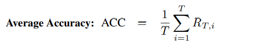
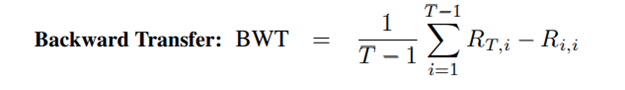
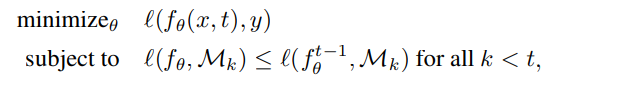
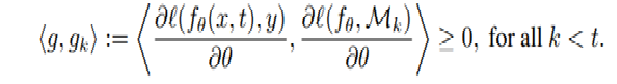
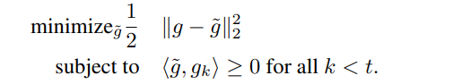
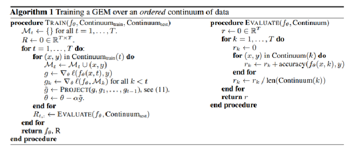

## **How to run the Notebook using Google Colab**

The following code needs to be run for the data set to be linked to the
notebook

**from google.colab import drive**

**drive.mount(\'/content/drive\')**

It would ask for an authorization code with a link provided, click on
the link, chose your google drive account, copy the authorization code
and paste it back to where the code was run

Then use the dataset mnist.npz provided in the github, download it and
upload to the google drive at the location

**/content/drive/My Drive/Colab Notebooks/**

Then you should be able to Extract the Test and Train data using the
following code( already in the notebook)

**f = np.load(\'/content/drive/My Drive/Colab Notebooks/mnist.npz\')**

## **Why Continual Learning**

One major obstacle towards AI is the poor ability of models to solve new
problems quicker, and without forgetting previously acquired knowledge
This general problem is termed *catastrophic forgetting*. Avoiding
catastrophic forgetting and achieving nontrivial *backwards
transfer* (BT) and *forward transfer* (FT) are major goals for continual
learning models, and in addition, general AI.

## **Memory-Based CL approaches**

These approaches use episodic memory that stores a subset of data from
past tasks to tackle forgetting. One approach to leverage such episodic
memory is to use it to constrain the optimization such that the loss on
past tasks can never increase

## **Algorithm used: GEM (Gradient Episodic Memory)**

The 3 components involved are

> *\
> **Memory:*** For each task, let's make sure we don't forget them. We'll
> keep a portion of them in memory.
>
> ***Episodic:*** Let's replay these memories to make sure we're not
> damaging our accuracy on these tasks when we learn new ones. By
> playing them over again, we're basically going through an episode
>
> ***Gradient:*** When we look at the episode again, let's make sure the
> gradient doesn't go the wrong way. What this means is: let's not
> unlearn what we learned on the previous task.

GEM aims to increase Backward Transfer so that knowledge gained with
each new Task does not result in forgetting previously gained knowledge
of Previous tasks.

Formally, Backward transfer (BWT), is the influence that learning a task
t has on the performance on a previous task k ≺ t. On the one hand,
there exists positive backward transfer when learning about some task t
increases the performance on some preceding task k. On the other hand,
there exists negative backward transfer when learning about some task t
decreases the performance on some preceding task k. Large negative
backward transfer is also known as (catastrophic) forgetting

The focus is to minimize Backwards Loss (aka maximize Backwards
Transfer).

**Metrics Calculated:**

Ri,j is the test classification accuracy of the model on task tj after
observing the last sample from task ti .

In order for a gradient update to take place, compute the dot product of
the current learning task with all the previous tasks in memory. The
update is allowed to take place if the gradient is greater than or equal
to 0 for all the episodes. This translates into constraining update for
one task to not conflict with an update for the previous task.

If the gradient is going the wrong way, take this gradient update and
project it to the closest possible vector that doesn't go the wrong way.
It formulates the optimization as a projection on to a cone).

Mathematically above gradient update solutions translate to below

t here is Task

when observing the triplet (x, t, y), solve the following problem:

where f ~θ~ ^t−1^ is the predictor state at the end of learning of task
t − 1.

The constraint above is rephrased as below by calculating the angle
between previous tasks' loss gradient vector and the proposed update
gradient from the current task

If all the inequality constraints are satisfied, then the proposed
parameter update g is unlikely to increase the loss at previous tasks.
On the other hand, if one or more of the inequality constraints are
violated, then there is at least one previous task that would experience
an increase in loss after the parameter update. If violations occur,
project the proposed gradient g to the closest gradient g˜ (in squared
\`2 norm) satisfying all the constraints. The net equation to be solved
is

This is solved using Quadratic Programming to obtain the WEIGHTS that
will increase Backward transfer or not Increase Loss!!!

## **TRAIN function:**

-   Initialize memory for each task t.

-   Initialize R matrix which is test accuracy after learning tasks.

-   for each task t = 1,\....T, and for each continuum data (x, y) in
    that task t, keep the last m = M / T samples

-   g is the gradient of the loss function based on the current sample

-   g~k~ is the gradient of the loss function on the memory unit M~k~. g
    is a list of the gradients.

-   g\~ is the projection of the gradient on current sample g with the
    gradient vector on all memory units

-   Weights updated as per Stochastic Descent Algorithm using a
    hyperparameter and gradient g\~

-   Update the matrix R using Evaluate function on test data.

## **Evaluate function:**

-   Initialize r vector to zero

-   for each task t, and for each continuum data (x, y) in that task,
    add accuracy on current test data sample.

-   After all the samples in current task are added, divide by the size
    of the samples in that task.

-   Return the predictor function , matrix R

-   Calculate BWT, FWT and plot graphs.

## **DataSet**

We use MNIST handwritten digit dataset. It consists of 60,000 images for
training and 10,000 images for testing. Each image is 28\*28 pixels. We
rotate these digits by a certain angle and then try to predict the
number

In this project we use 10 tasks (10 different rotation angles from 0 to
90 degrees).Which means each of the 10 tasks has 60,000 images for
training and 10,000 images for testing.

## **Architecture**

Fully connected neural networks with six hidden layers of 250 ReLU
units.

Mini batch size = 32

Algorithm to optimize - Stochastic Gradient Descent

**Here are all the arguments:**

**args = {\
\'model\' : \'gem\',\
\'lr\' : 0.05,\
\'n_memories\' : 512,\
\'memory_strength\' : 0.9,\
\'seed\' : 0, \'batch_size\' : 32,\
\'shuffle_tasks\' : \'no\',\
\'samples_per_task\' : -1,\
\'n_epochs\' : 1,\
\'n_layers\' : 6,\
\'n_hidden\' : 250,\
\'data_file\' : \'mnist_rotations.pt\',\
\'log_every\' : 100\
}**

## **FINAL RESULTS**

**Final Accuracy = 0.952332\
Backward Trasnfer = -0.025853\
Forward Trasnfer = 0.764005\
\-\-- 71.87696500221888 minutes \-\--**

## **Important Methods in Code**

**store_grad** -- This Method stores the gradient for Past Tasks

**overwrite_grad** -- This Method overwrites the gradient with a new
Projected gradient Vector whenever violations occur i.e. The Current
Tasks gradient results in Increase in Loss for any of the Previous Tasks

**project2cone2** -- This Method uses Quadratic Programming to solve the
Inequality equation to come up with projected gradient value

## **Important CLASS in the Code**

## **Net**

This class does a number of things like:

Allocate Memory for Tasks

Calculate Predictions for each Task

Store Examples for each Task

Calculate Gradients for previous Tasks

Calculate Gradient of current Task minibatch

Checks if Current task Gradient violates Constraints

**Reference -
https://github.com/facebookresearch/GradientEpisodicMemory**
